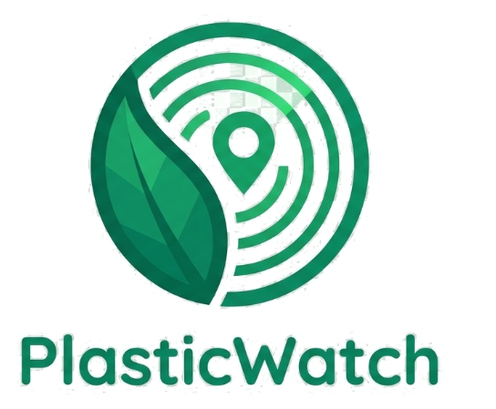
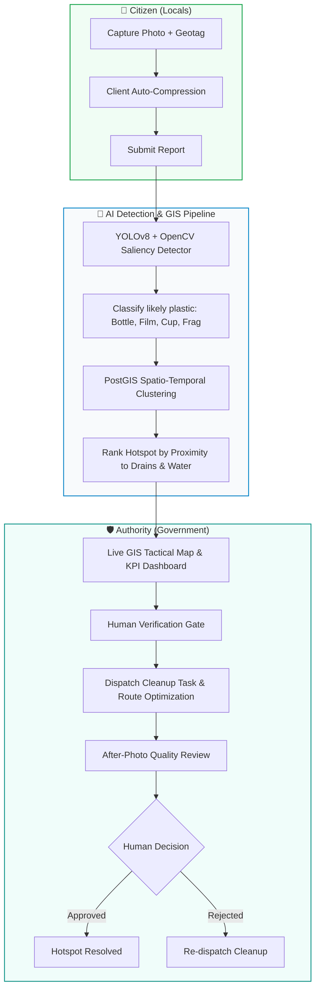

<div align="center">



# PlasticWatch
### AI-GIS Detection & Ethical Prioritisation of Plastic-Waste Hotspots

[](https://plasticwatch-1.onrender.com)
[](https://github.com/ayus0109/PlasticWatch/actions)
[](LICENSE)
[](https://fastapi.tiangolo.com)
[](https://react.dev)
[](https://www.typescriptlang.org/)
[](https://postgis.net/)
[](https://tailwindcss.com/)

[**Explore Live Demo »**](https://plasticwatch-1.onrender.com) · [Report Bug](https://github.com/ayus0109/PlasticWatch/issues) · [Request Feature](https://github.com/ayus0109/PlasticWatch/issues) · [API Documentation](https://plasticwatch-1.onrender.com/docs)

</div>

---

## 📖 Overview

**PlasticWatch** is an open-source, eco-GIS environmental intelligence platform that pinpoints, ranks, and tracks plastic waste hotspots in real time.

By combining lightweight Computer Vision (trained on the open [TACO](https://tacodataset.org/) dataset with OpenCV fallback) and PostGIS spatial clustering, citizen photos fuse into unified geographical hotspots ranked by ecological urgency (proximity to storm drains, water bodies, and amenities).

> [!IMPORTANT]
> **Core Ethical Law:** Reports show waste is present — **never who is responsible**. Nothing is verified or resolved until a human authority confirms evidence. The AI model guides prioritization; it never has the final word.

---

## 🏛️ System Architecture



---

## ✨ Key Features

| Feature | Description |
|---|---|
| **📸 Citizen Reporting** | Fast, mobile-first photo upload with auto GPS tagging, client-side EXIF reading, and instant bounding-box inference. |
| **🧠 Dual-Engine AI Detection** | YOLOv8 neural network mapped to standardized plastic categories with OpenCV contour/saliency fallback for crushed and fragmented waste. |
| **🗺️ Spatio-Temporal GIS Clustering** | Merges duplicate proximate reports into a single living hotspot using PostGIS spatial algorithms (`ST_DWithin`, GiST indexing). |
| **🌊 Eco-Impact Ranking** | Scores each hotspot automatically by distance to waterways, storm drains, schools, and civic amenities. |
| **🛡️ Tactical Authority Dashboard** | High-performance interactive Leaflet GIS map, prioritized triage queue, cleanup dispatch with route optimization, and human verification gates. |
| **🌗 Adaptive Theme Engine** | Eco-GIS palette engineered for bright outdoor field sunlight (Light Mode) and low-light control rooms (Dark Mode). |

---

## 🌐 UN Sustainable Development Goals (SDGs)

PlasticWatch directly contributes to three UN Sustainable Development Goals:
- **SDG 11: Sustainable Cities and Communities** — Reducing urban plastic accumulation and preventing drain blockages.
- **SDG 12: Responsible Consumption and Production** — Monitoring real-world single-use packaging leakage.
- **SDG 14: Life Below Water** — Intercepting plastic waste at urban drain corridors before it reaches oceans and rivers.

---

## 🛠️ Tech Stack

### Frontend
- **Framework:** React 19 + TypeScript + Vite
- **Styling:** Tailwind CSS + Lucide Icons + Eco-GIS Design System
- **Mapping:** Leaflet + React-Leaflet with custom vector canvas markers
- **State & Networking:** Lightweight resilient fetch client with exponential backoff & auto-reauth

### Backend & AI
- **Framework:** FastAPI (Python 3.11)
- **Database:** PostgreSQL 16 + PostGIS 3.4 (SQLAlchemy Core, async connection pool)
- **Computer Vision:** Ultralytics YOLOv8 + OpenCV Saliency Engine
- **Spatial Routing:** OpenRouteService API integration for cleanup dispatch optimization

### Infrastructure & DevOps
- **Deployment:** Render (Blueprint-as-Code via `render.yaml`)
- **Containers:** Docker Compose (Multi-container PostGIS + FastAPI stack)
- **CI / Quality:** GitHub Actions automated typecheck, build, and Ruff linter

---

## 🚀 Quickstart

### Option 1: Docker (Recommended)

Requires **Docker Desktop** installed and running.

```bash
# 1. Clone repository
git clone https://github.com/ayus0109/PlasticWatch.git
cd PlasticWatch

# 2. Configure environment
cp .env.example .env

# 3. Launch database and API
docker compose up -d --build

# 4. Verify API health
curl http://localhost:8000/health
# Expected: {"status":"ok","postgis":true}
```

Interactive API documentation available at: **<http://localhost:8000/docs>**

### Option 2: Local Frontend Development

```bash
cd frontend
npm install
npm run dev
# App will run at http://localhost:5173
```

---

## 📂 Repository Structure

```
PlasticWatch/
├── .github/                  # GitHub Actions CI workflows & issue templates
├── backend/
│   ├── app/
│   │   ├── routers/          # FastAPI API route handlers (auth, hotspots, reports)
│   │   ├── services/         # AI detector, GIS clustering, impact scorer
│   │   ├── sql/              # Schema & spatial migrations (schema.sql)
│   │   ├── config.py         # Type-safe environment settings
│   │   └── schemas.py        # Pydantic data models & frozen API contracts
│   └── tests/                # Automated pytest contract & unit tests
├── frontend/
│   ├── src/
│   │   ├── api/              # Resilient HTTP client & hooks
│   │   ├── components/       # UI design system (Shell, Map, Icons, Cards)
│   │   ├── pages/            # Login, Report, MyReports, Authority Dashboard
│   │   └── lib/              # Eco-GIS palette & status formatting
│   └── public/               # Favicons, vector brand assets, 404 fallback
├── gis/                      # Overpass OSM downloaders & spatial seed scripts
├── ml/                       # TACO dataset prep, converter & evaluation scripts
├── docs/                     # Technical specifications, user journeys & demo guide
├── docker-compose.yml        # Multi-container PostGIS + API orchestration
├── render.yaml               # Infrastructure blueprint for automated cloud deploy
└── CLAUDE.md                 # Architectural constitution & core project tenets
```

---

## 🤝 Contributing

Contributions are welcome! Please read [CONTRIBUTING.md](CONTRIBUTING.md) and [CODE_OF_CONDUCT.md](CODE_OF_CONDUCT.md) before submitting pull requests.

```bash
# Run frontend checks
cd frontend && npm run build

# Run backend linter
ruff check backend/app
```

---

## 🔒 Security

For responsible disclosure of security vulnerabilities, please refer to [SECURITY.md](SECURITY.md).

---

## 📄 License

This project is licensed under the [MIT License](LICENSE).
Geo data © [OpenStreetMap](https://www.openstreetmap.org/) contributors.
Detection trained on open [TACO](https://tacodataset.org/) annotations.
