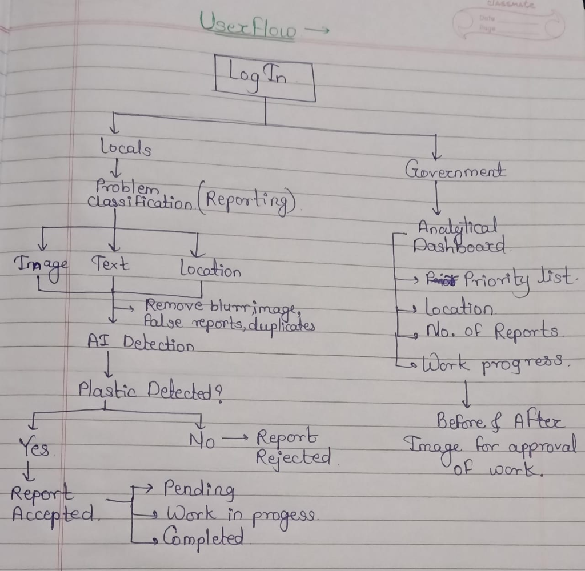
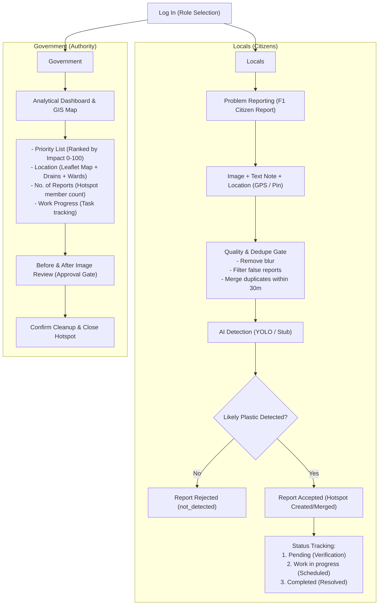

# PlasticWatch Userflow Specification

This document defines the primary user journey and interaction model for PlasticWatch based on the team's approved flow design.

## Key Principles & System Mapping

### 1. Locals (Citizen Portal)
- **Input**: User uploads a photo, optional text description, and location (automatic browser GPS with EXIF & interactive map-pin fallback).
- **Automated Quality & Dedupe**:
  - Blurry images are rejected via Laplacian variance blur detection (`services/quality.py`).
  - Duplicates are detected via pHash image fingerprinting and spatial proximity (30 m radius) to prevent duplicate work orders (`services/dedupe.py`).
- **AI Triage**:
  - Detections classify "likely plastic" items and measure pile area (`services/detector.py`).
  - If no plastic is detected, the report is rejected with clear feedback.
  - If plastic is detected, the report is accepted and attached to a hotspot.
- **Status Lifecycle**:
  - **Pending**: Hotspot is waiting for human authority verification.
  - **Work in progress**: Hotspot is assigned to a cleanup task.
  - **Completed**: Hotspot has been cleaned, verified via before/after photos, and resolved by authority.

### 2. Government (Authority Dashboard)
- **Analytical Dashboard**:
  - **Priority List**: Hotspots prioritized by multi-factor Impact score (Severity, Recurrence, Sensitivity to drains/water, Persistence).
  - **Location Map**: Real-time Leaflet map displaying priority-coded hotspots, drainage lines, water bodies, and ward choropleths.
  - **No. of Reports**: Aggregate evidence tracker showing multi-citizen confirmations.
  - **Work Progress**: Active cleanup routes, dispatched teams, and progress milestones.
- **Before & After Approval Gate**:
  - Cleanup teams submit wide and close-up "after" photos.
  - The system analyzes reduction but **never auto-resolves**.
  - Government officials visually inspect the side-by-side photos and provide final confirmation to close the hotspot.
